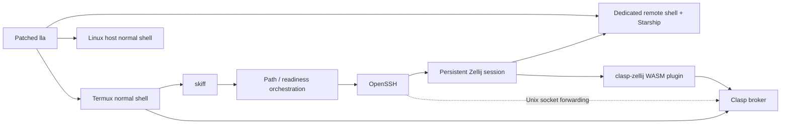

# Architecture

This document owns the stable module boundaries and high-level flows. Exact third-party source pins
are owned by [`../upstream.lock.toml`](../upstream.lock.toml); do not duplicate their SHAs here.
Implementation details belong in the owning parent/child issue, crate, tests, and nearest scoped
`AGENTS.md`.

## Components



- **Skiff** owns path convergence, target readiness/WoL, SSH lifecycle, reconnect behavior, and entry
  into the configured Zellij session. Core owns a configurable remote-entrypoint contract at that
  boundary; it must be testable with a synthetic/stub entrypoint. Downstream Shell parent #4 owns the
  concrete dedicated Bash/Zellij/Starship environment that is later plugged into that contract.
- **Clasp** owns the explicit Android/remote clipboard protocol boundary.
- **clasp-zellij** is UX glue for an explicit one-keystroke paste operation; it does not own the
  transport.
- **patched lla** owns the two-line listing view and per-entry Git status. It is a normal user-shell
  tool on both Termux and the Linux host; the Skiff remote shell reuses the same host installation.
- **Starship** owns prompt context and repository-wide Git state, avoiding duplication in lla.
- **Build/CI** produces target-specific artifacts and provenance.
- **Install** consumes verified releases to bootstrap/update Termux and the Linux host.
- **Release** owns SemVer materialization, owner-controlled signed tags, attestations, and immutable
  GitHub publication.

## Network convergence

Parent issue #3 is the canonical implementation contract. The intended prerequisite order is:

```text
home/private path reachable
  -> target online (SSH success also proves this)
  -> Wake-on-LAN only when target+SSH are unavailable
  -> host-ready wait
  -> separate SSH-ready wait
  -> OpenSSH
  -> attach/create Zellij
```

After transport loss, the remote Zellij session remains authoritative and Skiff reconverges from the
home-path prerequisite. Core does not wait for downstream Shell #4 to implement the dedicated shell;
it verifies the remote-entrypoint boundary with a stub, while #4 later supplies the real shell
integration. No router-vendor-specific wake API is part of v0.1.

## Configuration boundary

The public repository contains only a synthetic `config.example.toml`. Runtime values belong in an
XDG user configuration path such as `~/.config/skiff/config.toml` and are never release inputs.
The schema shown in the example is provisional until Core parent #3 owns a stable configuration model.

## Build boundaries

Linux and Android/Termux are not treated as merely different CPU architectures. Platform-specific
capabilities use Rust target cfgs/features/modules while portable behavior stays shared. Distinct
products (`skiff`, `clasp`, patched `lla`, `clasp-zellij`) remain distinct deliverables.

Android/Termux release builds use a direct Android NDK cross-build approach; the `termux-packages`
build environment is intentionally not the build substrate. Parent #7 owns CI/artifact production,
#11 owns installation, and #12 owns final release publication.

## Upstream patching

The lla strategy is pin -> apply minimal patch -> verify/build -> propose upstream. A permanent fork
is created only if real long-term divergence becomes necessary. Parent #6 owns patch semantics and
uses the exact upstream revision from `upstream.lock.toml`.
